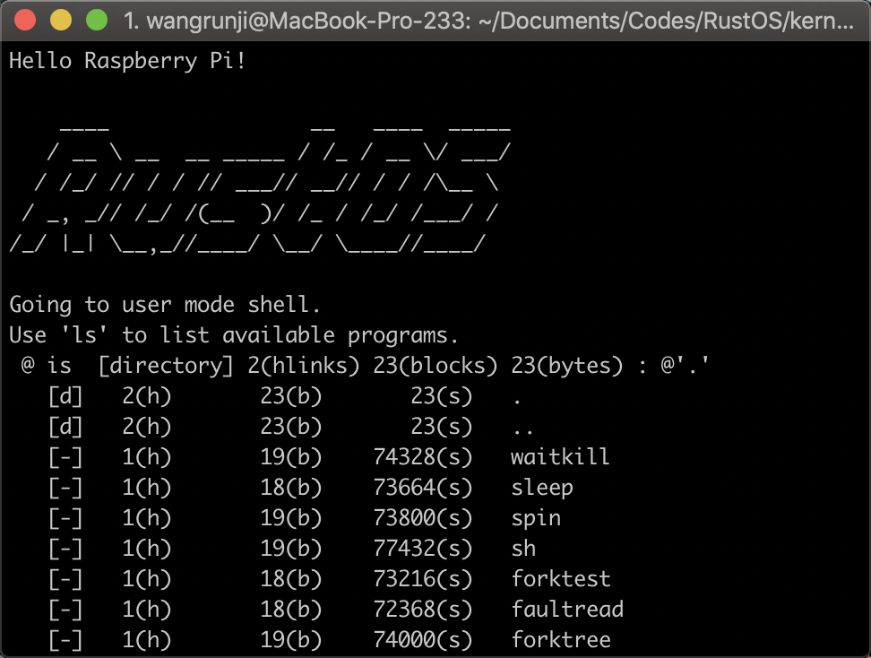

# rCore

[](https://travis-ci.org/oscourse-tsinghua/rcore_plus)

Rust version of THU [uCore OS Plus](https://github.com/chyyuu/ucore_os_plus).

Going to be the next generation teaching operating system.

Supported architectures: x86_64, RISCV32/64, AArch64, MIPS (planned)

Tested boards: QEMU, HiFive Unleashed, x86_64 PC (i5/i7), Raspberry Pi 3B+

[Dev docs](https://rucore.gitbook.io/rust-os-docs/) (in Chinese)



## Building

### Environment

* [Rust](https://www.rust-lang.org) toolchain at nightly-2019-02-16
* Cargo tools: [cargo-xbuild](https://github.com/rust-osdev/cargo-xbuild)
* [QEMU](https://www.qemu.org) >= 3.1.0
* [bootimage](https://github.com/rust-osdev/bootimage) (for x86_64)
* [RISCV64 GNU toolchain](https://www.sifive.com/boards) (for riscv32/64)
* [AArch64 GNU toolchain](https://cs140e.sergio.bz/assignments/0-blinky/) (for aarch64)
* [musl-cross-make](https://github.com/richfelker/musl-cross-make) (for userland musl)

See [Travis script](./.travis.yml) for details.

### How to run

```bash
$ rustup component add rust-src
$ cargo install cargo-xbuild bootimage
```

```bash
$ git clone https://github.com/rcore-os/rCore.git --recursive
$ cd rCore/user
$ make sfsimg arch={riscv32,riscv64,x86_64,aarch64} # requires x86_64-linux-musl-gcc or musl-gcc
$ cd ../kernel
$ make run arch={riscv32,riscv64,x86_64,aarch64} mode=release
```

## History

This is a project of THU courses:

* Operating System (2018 Spring) 
* Comprehensive Experiment of Computer System (2018 Summer)
* Operating System Train (2018 Autumn)
* Operating System (2019 Spring)

Project wiki (internal access only): [OS](http://os.cs.tsinghua.edu.cn/oscourse/OS2018spring/projects/g11), [CECS](http://os.cs.tsinghua.edu.cn/oscourse/csproject2018/group05), [OST](http://os.cs.tsinghua.edu.cn/oscourse/OsTrain2018)

Reports (in Chinese): [docs](./docs)

It's based on [BlogOS](https://github.com/phil-opp/blog_os) , a demo project in the excellent tutorial [Writing an OS in Rust (First Edition)](https://os.phil-opp.com/first-edition/).

## License

The source code is dual-licensed under MIT or the Apache License (Version 2.0).
