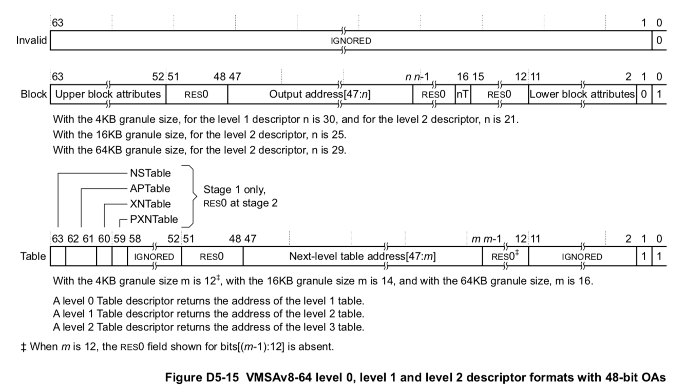

# 内存管理

## AArch64 虚拟内存系统

> 参考：ARM Architecture Reference Manual ARMv8, for ARMv8-A architecture profile, capture D5: The AArch64 Virtual Memory System Architecture.

(注：AArch64 可能拥有一些可选的配置，如页大小、页表级数等，以下描述都是指在 RustOS 中的实现，不代表只有这一种实现方式)

### 地址空间 (D5.1.3)

AArch64 拥有 64 位地址，支持两段虚拟内存地址空间，分别为：

* 低地址空间：高 16 位是 0，从 `0x0000000000000000` 到 `0x0000FFFFFFFFFFFF`
* 高地址空间：高 16 位是 1，从 `0xFFFF000000000000` 到 `0xFFFFFFFFFFFFFFFF`

在 RustOS 中，低地址空间被用于内核地址空间，高地址空间被用户用户程序地址空间。

### 地址翻译系统 (D5.2)

地址翻译系统(address translation system)，会随着 MMU 的启用而启用，负责将虚拟地址(或输入地址，IA)映射为物理地址(或输出地址，OA)。完整的翻译过程包含两个阶段 stage 1 与 stage 2，一般只使用 stage 1 的输出作为最终的物理地址。

翻译的基本流程是：给定翻译表(translation table，也可称为页表)的基址，截取虚拟地址中的一段 bit，将其作为索引去翻译表中查找，查得的地址作为下一级翻译表的基址。最后一级翻译表返回的是物理页帧(page)的基址，加上虚拟地址页内偏移即可得到物理地址。

第 0 级翻译表的基址保存在翻译表基址寄存器(Translation Table Base Register, TTBR)中，有两个，分别为  `TTBR0_EL1` 和 `TTBR1_EL1`，MMU 会根据虚拟地址是位于低地址空间还是高地址空间，自动选择对应的 TTBR。相当于低地址空间与高地址空间各用一套不同的地址翻译系统。

翻译表共有 4 级(0~3)，一般每级有 512 个表项，因此每级翻译表的索引为 9 位，一个翻译表的大小为 512 x 8 = 4KB。而最后得到的物理页帧的大小一般为 4KB，页内偏移有 12 字节。

一般来说，最后一级得到的物理页帧大小为 4KB，不过也可不用翻译到最后一级，而在中间的某一级就停止翻译，直接返回一个物理页帧的地址，此时该页帧的大小会大于 4KB，一般称其为块(block)。如在第 1 级就返回，会得到一个 1GB 的物理内存块；如在第 2 级返回，会得到一个 2MB 的物理内存块。翻译表项中有专门的位来区别该表项中的地址是下一级翻译表的基址还是一个块的基址。


使用翻译控制寄存器(Translation Control Register, TCR) `TCR_EL1` 可配置翻译系统的参数，常用的字段如下：

1. AS, bit [36]：ASID 的大小，8 位或 16位。RustOS 中为 16 位。
2. IPS, bit [24:32]：中间级物理地址大小。由于 RustOS 不使用 stage2 翻译系统，所以该地址就是物理地址。一般设为与 `ID_AA64MMFR0_EL1` 中的 `PARange` 字段一致。
3. TG0/1：低/高地址空间翻译系统的物理页帧粒度，4KB、16KB 或 64KB。RustOS 中都为 4KB。
4. SH0/1：低/高地址空间翻译系统的内存共享属性，不共享、内部共享或外部共享。RustOS 中都为内部共享。
5. ORGN0/1：低/高地址空间翻译系统的外部缓存属性。
6. IRGN0/1：低/高地址空间翻译系统的内部缓存属性。
7. EPD0/1：是否使用 `TTBR0/1_EL1` 翻译系统。RustOS 中为都使用。
8. T0/1SZ：在低/高地址空间翻译系统中，第 0 级翻译表从高往低数第几位开始索引。RustOS 中都为 16，即从第 48 位开始索引。
9. A1：ASID 定义在 `TTBR0_EL1` 还是 `TTBR1_EL1` 中。RustOS 中为 `TTBR1_EL1`。

### 翻译表描述符 (D5.3)

翻译表描述符即翻译表项，由一段地址空间的基址与这段地址空间的属性构成。根据这段地址空间的用处不同，将描述符分为 3 类：

1. 页描述符(page descriptor)：该描述符中的地址指向一个 4KB 大小的页；
2. 块描述符(block descriptor)：该描述符中的地址指向一个 1GB 或 2MB 大小的块；
3. 表描述符(table descriptor)：该描述符中的地址指向另一个翻译表。

#### 第 0, 1, 2 级翻译表描述符

第 0 级翻译表只能包含表描述符，第 1、2 级翻译表同时支持表描述符与块描述符。一个描述符的各字段如下图所示：



#### 第 3 级翻译表描述符

第 3 级翻译表只能包含页描述符。一个描述符的各字段如下图所示：


#### 表描述符属性


#### 块/页描述符属性


各字段的具体说明详见官网文档 ARMv8 Reference Manual D5.3.3 节。

### 内存属性 (D5.5)

可为一段内存设置的特定属性，如可缓存性、可共享性、内存类型等。

#### 内存类型与可缓存性

可为内存设置多达 8 个不同的类型，每个类型的内存的可缓存性不同。如普通可缓存内存、普通不可缓存内存、设备内存等。
在块/页描述符的 AttrIndex 字段可设置内存的类型。

8 种内存类型的配置通过 `MAIR_EL1` 实现，每 8 位代表一种类型的内存配置。具体参见 ARMv8 Reference Manual D12.2.82 节。

#### 可共享性

可共享性分为 3 种：

1. 不可共享，即每个核都不与其他核共享这段内存；
2. 内部共享，即多核之间可以共享这段内存；
3. 外部共享，即除了多核之间外，CPU 与 GPU 之间也可共享这段内存。

在块/页描述符的 SH 字段可设置内存的可共享性。


### TLB、Cache 操作

#### TLB 操作 (C5.5)

TLB (Translation Lookaside Buffers) 是翻译表的缓存，如果一个虚拟地址在 TLB 中命中，将不再通过地址翻译系统翻译，而是直接从缓存中得到物理地址。

当翻译表被修改后，需要刷新 TLB，以防由于缓存而使新的虚拟——物理地址映射不起作用。有以下两种刷新方式：

* 根据虚拟地址刷新：只会使 TLB 中的该虚拟地址无效，代码如下：

    ```armasm
    dsb ishst
    tlbi vaae1is, <vaddr>
    dsb ish
    isb
    ```

* 全部刷新：会使 TLB 中的所有表项无效，代码如下：

    ```armasm
    dsb ishst
    tlbi vmalle1is
    dsb ish
    isb
    ```

#### Cache 操作 (C5.3)

Cache 是主存的缓存，如果一个物理地址在 cache 中命中，将不会访问主存，而是直接从 cache 中得到数据。Cache 又分为指令 cache 与 数据 cache，分别作用在取指与普通访存时。

当通过普通访存的形式修改了代码段的数据，并跳转到了这里运行，此时需要刷新指令 cache，以防取指时从指令 cache 中取到旧的数据。指令 cache 可使用下列代码一次性全部清空：

```armasm
ic ialluis
dsb ish
isb
```

当 CPU 与 GPU 通信，共享一段内存时，由于 GPU 不使用 cache，需要保证 CPU 写入数据时一定被写入主存了而不是在 cache 中，以便 GPU 能读出正确的数据；同时，也要保证这段内存不在 cache 中，以便 GPU 对其进行修改后 CPU 能立即看到修改的结果。这时候就需要清空数据 cache 了。可使用下列代码清空一个 cache line 的数据：

```armasm
dc civac, <vaddr>
dsb sy
isb
```

Cache line 的大小可通过 `CTR_EL0` 寄存器读取，一般为 16 个 WORD，即 64 字节。

### ASID 机制 (D5.9.1)

在上下文切换时，需要修改 TTBR1_EL1 寄存器，如果不刷新 TLB 也不使用 ASID，TLB 中将会保留旧进程的虚拟——物理地址映射关系，导致进程访问错误的物理地址。不过如果每次上下文切换都刷新 TLB，开销又较大。

ASID 的引入就是为了避免在上下文切换过程中刷新 TLB。上下文切换时，每个进程会被分配一个唯一的 ASID，并将其保存到 `TTBR1_EL1` 的高 16 位中。此时 TLB 中会同时记录一个虚拟地址及其进程的 ASID 对应的物理地址，使得不同进程的相同虚拟地址在 TLB 中也会被映射为不同的物理地址。

## RustOS 中的实现
